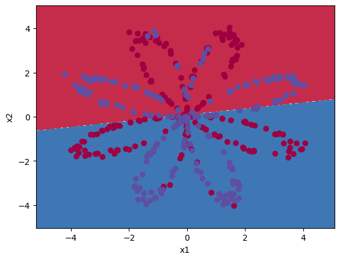
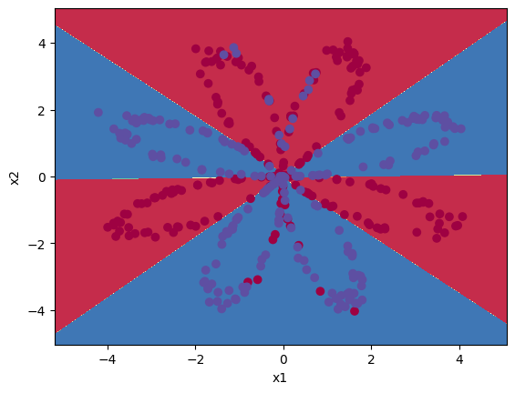

# Neural Networks and Deep Learning

The course, Neural Networks and Deep Learning, provides a comprehensive introduction to the fundamentals necessary to start delving into deep learning. What makes this course truly remarkable is that I was able to develop a deep neural network from scratch without relying on any machine learning framework. That's correct! By utilizing **Numpy**, I successfully implemented a neural network capable of classifying images into cat and non-cat categories.

## Description

This section provides a concise summary of each assignment in the course, accompanied by brief descriptions and a few figures.

- W2A1: [Python Basics with Numpy](https://htmlpreview.github.io/?https://github.com/lionlai1989/Deep_Learning_Specialization/blob/master/C1-Neural_Networks_and_Deep_Learning/W2A1-Python_Basics_with_Numpy/Python_Basics_with_Numpy.html)  
It helps me familiarize myself with various fundamental concepts in deep learning, such as the exponential function, sigmoid function and its derivative, softmax function, L1 and L2 loss functions, and more.  

- W2A2: [Logistic Regression with a Neural Network mindset](https://htmlpreview.github.io/?https://github.com/lionlai1989/Deep_Learning_Specialization/blob/master/C1-Neural_Networks_and_Deep_Learning/W2A2-Logistic_Regression_with_a_Neural_Network_Mindset/Logistic_Regression_with_a_Neural_Network_mindset.html)  
Logistic regression can be viewed as a shallow neural network with no hidden layers. I constructed a shallow neural network without any hidden layers to perform image classification, specifically distinguishing between cat and non-cat images. The implementation encompassed both forward and backward propagation, as well as inference.  

<figure>

<figcaption style="font-size: small;">y = 1.0, your algorithm predicts a "cat" picture --> I am @ikura.36 from Japan. I am the cutest cat in the world.</figcaption>
</figure>

- W3A1: [Planar Data Classification with One Hidden Layer](https://htmlpreview.github.io/?https://github.com/lionlai1989/Deep_Learning_Specialization/blob/master/C1-Neural_Networks_and_Deep_Learning/W3A1-Planar_Data_Classification_with_One_Hidden_Layer/Planar_data_classification_with_one_hidden_layer.html)  
It shows that logistic regression cannot perform well on a dataset that is not linearly separable. However, the same dataset can be easily classified using a shallow neural network with just one hidden layer.  

<figure float="left">

<figcaption style="font-size: small;">The left figure shows logistic regression cannot separate a dataset that is not linearly separable while the right figure shows that a neural network using one hidden layer with four units can easily separate the data.</figcaption>
</figure>

- W4A1: [Building your Deep Neural Network Step by Step](https://htmlpreview.github.io/?https://github.com/lionlai1989/Deep_Learning_Specialization/blob/master/C1-Neural_Networks_and_Deep_Learning/W4A1-Building_your_Deep_Neural_Network_Step_by_Step/Building_your_Deep_Neural_Network_Step_by_Step.html)  
It constructs all the fundamental elements necessary to build a deep neural network from scratch using NumPy. These building blocks serve as the foundation for constructing deep neural networks in the next practice.  

- W4A2: [Deep Neural Network Application](https://htmlpreview.github.io/?)  
A deep 4-layer neural network is built to classify between cat and non-cat images by using all the building blocks in the previous practice. The result shows that the 4-layer neural network has better performance (80%) than the W2A2's 2-layer neural network (72%) on the same test set.  

<figure>

<figcaption style="font-size: small;">y = 1.0, your algorithm predicts a "cat" picture --> I am @ikura.36 from Japan. It looks like your deep neural network can recognize me. Good Job!</figcaption>
</figure>

<figure>

<figcaption style="font-size: small;">y = 1.0, your L-layer model predicts a "cat" picture. --> I am Neneko from Taiwan. It looks like your deep neural network misrecognize me as a real cat. Hahahaha ... I am also the naughtiest cat in the world.</figcaption>
</figure>

## Reference:

- Week 2:
  - [Implementing a Neural Network from Scratch in Python – An Introduction](https://github.com/dennybritz/nn-from-scratch) (Denny Britz, 2015)
  - [Why normalize images by subtracting dataset's image mean, instead of the current image mean in deep learning?](https://stats.stackexchange.com/questions/211436/why-normalize-images-by-subtracting-datasets-image-mean-instead-of-the-current) (Stack Exchange)

- Week 3:
  - [CS231n: Convolutional Neural Networks for Visual Recognition](https://cs231n.github.io/neural-networks-case-study/) (Stanford University)

- Week 4:
  - [Autoreload of modules in IPython](https://stackoverflow.com/questions/1907993/autoreload-of-modules-in-ipython) (Stack Overflow)
