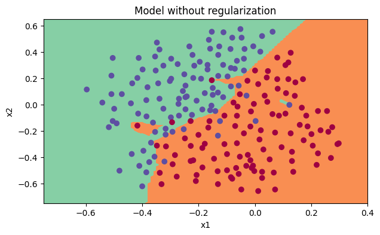
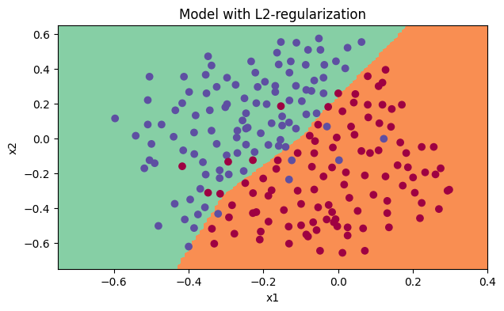
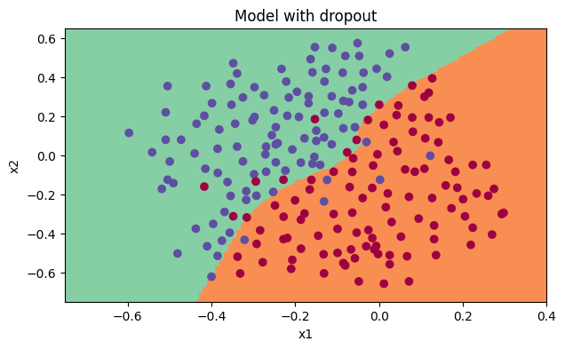

# Improving Deep Neural Networks: Hyperparameter Tuning, Regularization and Optimization

## Description

This section provides a concise summary of each assignment in the course, accompanied by brief descriptions and a few figures.

- W2A1: [Initialization](https://htmlpreview.github.io/?https://github.com/lionlai1989/Deep_Learning_Specialization/blob/master/C2-Improving_Deep_Neural_Networks_Hyperparameter_Tuning_Regularization_and_Optimization/W1A1-Initialization/Initialization.html)  
Initialization plays an important role in training neural networks. Zero initialization fails to break the symmetry, leading to no reduction in the cost. On the other hand, initializing weights and biases randomly does break the symmetry, but it requires more time to optimize the network. However, using He initialization demonstrates that it achieves the lowest cost in the least amount of time.  

- W2A2: [Regularization](https://htmlpreview.github.io/?https://github.com/lionlai1989/Deep_Learning_Specialization/blob/master/C2-Improving_Deep_Neural_Networks_Hyperparameter_Tuning_Regularization_and_Optimization/W1A2-Regularization/Regularization.html)  
Neural networks without regularization tend to overfit the training data, resulting in decreased performance during inference time. Applying L2 regularization and dropout techniques helps prevent neural networks from exhibiting high variance, thus improving generalization and robustness.  

<figure float="left">

</figure>

- W1A3: [Gradient Checking](https://htmlpreview.github.io/?https://github.com/lionlai1989/Deep_Learning_Specialization/blob/master/C2-Improving_Deep_Neural_Networks_Hyperparameter_Tuning_Regularization_and_Optimization/W1A3-Gradient_Checking/Gradient_Checking.html)  
Imagine yourself as Geoffrey Hinton back in 2012 when you were implementing backpropagation on a neural network for the first time. How did you ensure that your implementation was correct? Like any other research, how could you be sure about the result if it had never been done before? Gradient checking provided a way to verify the accuracy of your backpropagation.  

- W4A1: [Building your Deep Neural Network Step by Step](https://htmlpreview.github.io/?https://github.com/lionlai1989/Deep_Learning_Specialization/blob/master/C1-Neural_Networks_and_Deep_Learning/W4A1-Building_your_Deep_Neural_Network_Step_by_Step/Building_your_Deep_Neural_Network_Step_by_Step.html)  
It constructs all the fundamental elements necessary to build a deep neural network from scratch using NumPy. These building blocks serve as the foundation for constructing deep neural networks in the next practice.  

<figure float="left">

<figcaption style="font-size: small;">The left figure shows logistic regression cannot separate a dataset that is not linearly separable while the right figure shows that a neural network using one hidden layer with four units can easily separate the data.</figcaption>
</figure>

- W4A2: [Deep Neural Network Application](https://htmlpreview.github.io/?)  
A deep 4-layer neural network is built to classify between cat and non-cat images by using all the building blocks in the previous practice. The result shows that the 4-layer neural network has better performance (80%) than the W2A2's 2-layer neural network (72%) on the same test set.  

<figure>

<figcaption style="font-size: small;">y = 1.0, your algorithm predicts a "cat" picture --> I am @ikura.36 from Japan. It looks like your deep neural network can recognize me. Good Job!</figcaption>
</figure>

<figure>

<figcaption style="font-size: small;">y = 1.0, your L-layer model predicts a "cat" picture. --> I am Neneko from Taiwan. It looks like your deep neural network misrecognize me as a real cat. Hahahaha ... I am also the naughtiest cat in the world.</figcaption>
</figure>

## Reference:

- Week 2:
  - [Implementing a Neural Network from Scratch in Python – An Introduction](https://github.com/dennybritz/nn-from-scratch) (Denny Britz, 2015)
  - [Why normalize images by subtracting dataset's image mean, instead of the current image mean in deep learning?](https://stats.stackexchange.com/questions/211436/why-normalize-images-by-subtracting-datasets-image-mean-instead-of-the-current) (Stack Exchange)

- Week 3:
  - [CS231n: Convolutional Neural Networks for Visual Recognition](https://cs231n.github.io/neural-networks-case-study/) (Stanford University)

- Week 4:
  - [Autoreload of modules in IPython](https://stackoverflow.com/questions/1907993/autoreload-of-modules-in-ipython) (Stack Overflow)
