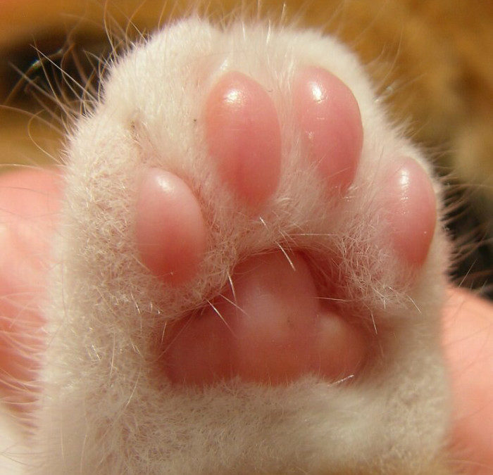
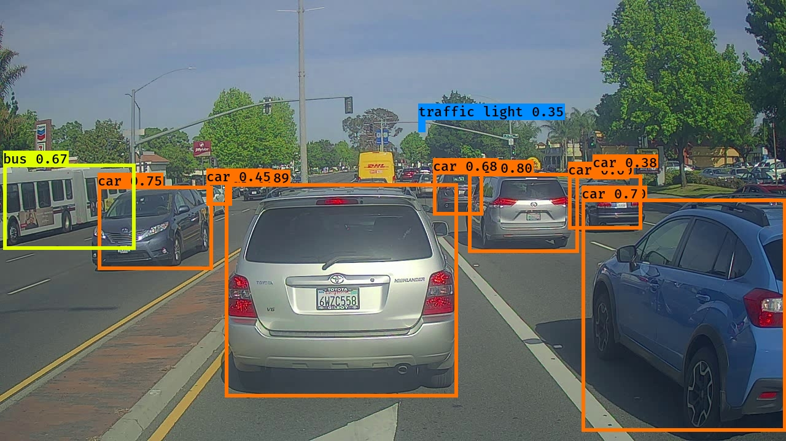

# Neural Networks and Deep Learning


## Description

This section provides a concise summary of each assignment in the course, accompanied by brief descriptions and a few figures.

- W1A1: [Convolutional Neural Networks: Step by Step](https://htmlpreview.github.io/?https://github.com/lionlai1989/Deep_Learning_Specialization/blob/master/C4-Convolutional_Neural_Networks/W1A1-Convolutional_Neural_Networks_Step_by_Step/Convolution_model_Step_by_Step_v1.html)

  A simple convolutional neural network, which embodies standard components shown in the graph below, is built from scratch, using only NumPy.  

<figure>

</figure>

- W1A2: [Convolutional Neural Networks: Application](https://htmlpreview.github.io/?https://github.com/lionlai1989/Deep_Learning_Specialization/blob/master/C4-Convolutional_Neural_Networks/W1A2-Convolution_Model_Application/Convolution_model_Application.html)

  I use TensorFlow to build a simple convolutional neural network to recognize hand gestures on numbers from zero to five.  

<figure>

</figure>

- W2A1: [Residual Networks](https://htmlpreview.github.io/?https://github.com/lionlai1989/Deep_Learning_Specialization/blob/master/C4-Convolutional_Neural_Networks/W2A1-Residual_Networks/Residual_Networks.html)

  A 50-layer ResNet, as shown below, is built and used to recognize hand gestures on numbers from zero to five.  
  <figure>
  
  </figure>

  After training, it achieves quite impressive results on the testing dataset (accuracy > 80%). I also use images from different data distributions to see if this model can recognise them. For example, two cats' paw images are used:  
  <figure float="left">
  
  
  <figcaption style="font-size: small;">The first image shows "Class: 4". The second image shows "Class: 0".</figcaption>
  </figure>

  Surprisingly, this ResNet model can correctly recognise a real cat's paw, which has four fingers. Unfortunately, the model fails on the second image. I suppose that the data distribution of the second image is too different from the training dataset's distribution.  

- W2A2: [Transfer Learning with MobileNetV2](https://htmlpreview.github.io/?https://github.com/lionlai1989/Deep_Learning_Specialization/blob/master/C4-Convolutional_Neural_Networks/W2A2-Transfer_Learning_with_MobileNet/Transfer_learning_with_MobileNet_v1.html)

  Transfer learning is a vital skill in today's world as it allows us to leverage pre-trained open-source models. For this task, I utilized `MobileNetV2` with pre-trained weights from `ImageNet`.
  ```
  base_model = tf.keras.applications.MobileNetV2(input_shape=IMG_SHAPE,
                                               include_top=True,
                                               weights='imagenet')
  ```
  The original `imagenet` has 1000 output labels. The main idea here is to either freeze all previous layers before the last softmax layer or freeze all layers except the last few ones, and then replace the last layer, consisting of 1000 labels, with a single neuron for binary classification.

- W3A1: [Car Detection with YOLO](https://htmlpreview.github.io/?https://github.com/lionlai1989/Deep_Learning_Specialization/blob/master/C4-Convolutional_Neural_Networks/W3A1-Car_Detection_with_YOLO/Autonomous_driving_application_Car_detection.html)

  Utilizing just one forward propagation pass through the network, "You Only Look Once" (YOLO) enables predictions for the entire image without sacrificing inference accuracy (the manual sliding window method is not needed anymore). This efficiency makes it highly suitable for embedded systems where real-time immediacy is crucial for success.

  <figure>
  
  <figcaption style="font-size: small;">Objects are found after one forward pass through the network.</figcaption>
  </figure>

## Reference:

  - Week 1:
    - [The Sequential model](https://www.tensorflow.org/guide/keras/sequential_model) (TensorFlow Documentation)
    - [The Functional API](https://www.tensorflow.org/guide/keras/functional) (TensorFlow Documentation)

  - Week 2:
    - [Deep Residual Learning for Image Recognition](https://arxiv.org/abs/1512.03385) (He, Zhang, Ren & Sun, 2015)
    - [deep-learning-models/resnet50.py/](https://github.com/fchollet/deep-learning-models/blob/master/resnet50.py) (GitHub: fchollet)
    - [MobileNets: Efficient Convolutional Neural Networks for Mobile Vision Applications](https://arxiv.org/abs/1704.04861) (Howard, Zhu, Chen, Kalenichenko, Wang, Weyand, Andreetto, & Adam, 2017)
    - [MobileNetV2: Inverted Residuals and Linear Bottlenecks](https://arxiv.org/abs/1801.04381) (Sandler, Howard, Zhu, Zhmoginov &Chen, 2018)
    - [EfficientNet: Rethinking Model Scaling for Convolutional Neural Networks](https://arxiv.org/abs/1905.11946) (Tan & Le, 2019)

  - Week 3:
    - [You Only Look Once: Unified, Real-Time Object Detection](https://arxiv.org/abs/1506.02640) (Redmon, Divvala, Girshick & Farhadi, 2015)
    - [YOLO9000: Better, Faster, Stronger](https://arxiv.org/abs/1612.08242) (Redmon & Farhadi, 2016)
    - [YAD2K](https://github.com/allanzelener/YAD2K) (GitHub: allanzelener)
    - [YOLO: Real-Time Object Detection](https://pjreddie.com/darknet/yolo/)
    - [Fully Convolutional Architectures for Multi-Class Segmentation in Chest Radiographs](https://arxiv.org/abs/1701.08816) (Novikov, Lenis, Major, Hladůvka, Wimmer & Bühler, 2017)
    - [Automatic Brain Tumor Detection and Segmentation Using U-Net Based Fully Convolutional Networks](https://arxiv.org/abs/1705.03820) (Dong, Yang, Liu, Mo & Guo, 2017)
    - [U-Net: Convolutional Networks for Biomedical Image Segmentation](https://arxiv.org/abs/1505.04597) (Ronneberger, Fischer & Brox, 2015)

  - Week 4:
    - [FaceNet: A Unified Embedding for Face Recognition and Clustering](https://arxiv.org/pdf/1503.03832.pdf) (Schroff, Kalenichenko & Philbin, 2015)
    - [DeepFace: Closing the Gap to Human-Level Performance in Face Verification](https://research.fb.com/wp-content/uploads/2016/11/deepface-closing-the-gap-to-human-level-performance-in-face-verification.pdf) (Taigman, Yang, Ranzato & Wolf)
    - [facenet](https://github.com/davidsandberg/facenet) (GitHub: davidsandberg)
    - [How to Develop a Face Recognition System Using FaceNet in Keras](https://machinelearningmastery.com/how-to-develop-a-face-recognition-system-using-facenet-in-keras-and-an-svm-classifier/) (Jason Brownlee, 2019)
    - [keras-facenet/notebook/tf_to_keras.ipynb](https://github.com/nyoki-mtl/keras-facenet/blob/master/notebook/tf_to_keras.ipynb) (GitHub: nyoki-mtl)
    - [A Neural Algorithm of Artistic Style](https://arxiv.org/abs/1508.06576) (Gatys, Ecker & Bethge, 2015)
    - [Convolutional neural networks for artistic style transfer](https://harishnarayanan.org/writing/artistic-style-transfer/)
    - [TensorFlow Implementation of "A Neural Algorithm of Artistic Style"](http://www.chioka.in/tensorflow-implementation-neural-algorithm-of-artistic-style)
    - [Very Deep Convolutional Networks For Large-Scale Image Recognition](https://arxiv.org/pdf/1409.1556.pdf) (Simonyan & Zisserman, 2015)
    - [Pretrained models](https://www.vlfeat.org/matconvnet/pretrained/) (MatConvNet)