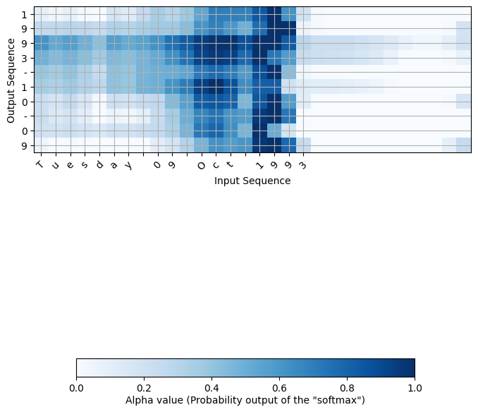

# Sequence Models


## Description

This section provides a concise summary of each assignment in the course, accompanied by brief descriptions and a few figures.

- W1A1: [Building a Recurrent Neural Network - Step by Step](https://htmlpreview.github.io/?https://github.com/lionlai1989/Deep_Learning_Specialization/blob/master/C5-Sequence_Models/W1A1-Building_a_Recurrent_Neural_Network_Step_by_Step/Building_a_Recurrent_Neural_Network_Step_by_Step.html)  
  I implement a basic RNN and LSTM model with only **Numpy**. No other machine learning framework is used.
  
  <figure float="left">
  
  <figcaption style="font-size: small;">An LSTM network comprises three gates, which can keep the information flowing from the current time step to the next, mitigating the vanishing gradient problem.</figcaption>
  </figure>

- W1A2: [Character level language model - Dinosaurus Island](https://htmlpreview.github.io/?https://github.com/lionlai1989/Deep_Learning_Specialization/blob/master/C5-Sequence_Models/W1A2-Dinosaur_Island_Character_Level_Language_Modeling/Dinosaurus_Island_Character_level_language_model.html)  
  A language model is a probability model designed to represent the language domain. Here, I use 1536 dinosaur names to train a character-level language model to generate artificial names for new dinosaurs. For instance, `Eiaantoe` would probably be a good name for a newly found dinosaur.

- W1A3: [Improvise a Jazz Solo with an LSTM Network](https://htmlpreview.github.io/?https://github.com/lionlai1989/Deep_Learning_Specialization/blob/master/C5-Sequence_Models/W1A3-Improvise_a_Jazz_Solo_with_an_LSTM_NetworkImprovise_a_Jazz_Solo_with_an_LSTM_Network_v4.html)  
  An improvised Jazz solo is generated. You can hear the music for yourself.
  [Click here to download generated music by AI.](./W1A3-Improvise_a_Jazz_Solo_with_an_LSTM_Network/output/rendered.wav)

- W2A1: [Debiasing Word Embeddings w.r.t. Gender](https://htmlpreview.github.io/?https://github.com/lionlai1989/Deep_Learning_Specialization/blob/master/C5-Sequence_Models/W2A1-Operations_on_Word_Vectors_Debiasing/Operations_on_word_vectors_v2a.html)  
  Due to the imbalance and insufficient training data used to train word embeddings, there exists biases in word embeddings. In this task, I first projected biased (non-gender specific) words into non-bias axis and then equalized gender-specific words. It can be summarized by the following two graphs.
  <figure float="left">
  
  
  <figcaption style="font-size: small;">.</figcaption>
  </figure>

- W2A2: [Emojify! - Automatically Generate Emojis from Texts](https://htmlpreview.github.io/?https://github.com/lionlai1989/Deep_Learning_Specialization/blob/master/C5-Sequence_Models/W2A2-Emojify/Emoji_v3a.html)  
  Given a sentence, I can assign the most suitable emoji to this sentence based on the context of it. The first model sums up the word vectors and classifies the output. The problem of the first model is that it doesn't consider the order of words. The second model uses LSTM architecture. (**Needs to be fixed**)

- W3A1: [Neural Machine Translation](https://htmlpreview.github.io/?https://github.com/lionlai1989/Deep_Learning_Specialization/blob/master/C5-Sequence_Models/W3A1-Neural_Machine_Translation_with_Attention/Neural_machine_translation_with_attention_v4a.html)  
  Understanding how attention mechnism works is a prerequisite to understand Transformer network. In this task, I use attention mechanism and LSTM network to build a naive machine translation model which can translate human-readable dates ("25th of June, 2009") into machine-readable dates ("2009-06-25"). Here is the testing result:
  ```
  1/1 [==============================] - 2s 2s/step
  source: 3 May 1979
  output: 1979-05-03 
  
  1/1 [==============================] - 0s 18ms/step
  source: 21th of August 2016
  output: 2016-08-21 
  
  1/1 [==============================] - 0s 19ms/step
  source: Tue 10 Jul 2007
  output: 2007-07-10 
  
  1/1 [==============================] - 0s 19ms/step
  source: Saturday May 9 2018
  output: 2018-05-09 
  
  1/1 [==============================] - 0s 18ms/step
  source: March 3rd 2001
  output: 2001-03-03 
  ```
  Moreover, we can visualize attention mechnism to see how the output sequence pays attention to which word in the input sequence. For instance, it shows `oct` is highly associated to `10`.
  <figure float="left">
  
  <figcaption style="font-size: small;">The darker color indicates that the assiciation between two characters is closer.</figcaption>
  </figure>

- W3A2: [Trigger Word Detection](https://htmlpreview.github.io/?https://github.com/lionlai1989/Deep_Learning_Specialization/blob/master/C5-Sequence_Models/)  

- W4A1: [Transformer Network](https://htmlpreview.github.io/?https://github.com/lionlai1989/Deep_Learning_Specialization/blob/master/C5-Sequence_Models/)  


## Reference:

- Week 1:
  - [Minimal character-level language model with a Vanilla Recurrent Neural Network, in Python/numpy](https://gist.github.com/karpathy/d4dee566867f8291f086) (GitHub: karpathy)
  - [The Unreasonable Effectiveness of Recurrent Neural Networks](http://karpathy.github.io/2015/05/21/rnn-effectiveness/) (Andrej Karpathy blog, 2015)
  - [deepjazz](https://github.com/jisungk/deepjazz) (GitHub: jisungk)
  - [Learning Jazz Grammars](http://ai.stanford.edu/~kdtang/papers/smc09-jazzgrammar.pdf) (Gillick, Tang & Keller, 2010)
  - [A Grammatical Approach to Automatic Improvisation](http://smc07.uoa.gr/SMC07%20Proceedings/SMC07%20Paper%2055.pdf) (Keller & Morrison, 2007)
  - [Surprising Harmonies](http://citeseerx.ist.psu.edu/viewdoc/download?doi=10.1.1.5.7473&rep=rep1&type=pdf) (Pachet, 1999)

- Week 2:
  - [Man is to Computer Programmer as Woman is to Homemaker? Debiasing Word Embeddings](https://papers.nips.cc/paper/2016/file/a486cd07e4ac3d270571622f4f316ec5-Paper.pdf) (Bolukbasi, Chang, Zou, Saligrama & Kalai, 2016)
  - [GloVe: Global Vectors for Word Representation](https://nlp.stanford.edu/projects/glove/) (Pennington, Socher & Manning, 2014)
  - [Woebot](https://woebothealth.com/)

- Week 4:
  - [Natural Language Processing Specialization](https://www.coursera.org/specializations/natural-language-processing?) (by DeepLearning.AI)
  - [Attention Is All You Need](https://arxiv.org/abs/1706.03762) (Vaswani, Shazeer, Parmar, Uszkoreit, Jones, Gomez, Kaiser & Polosukhin, 2017)
